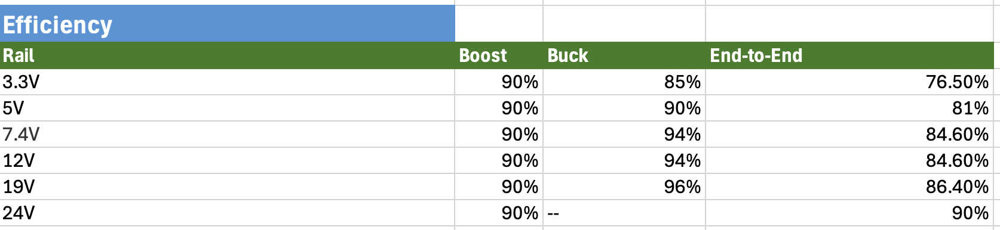
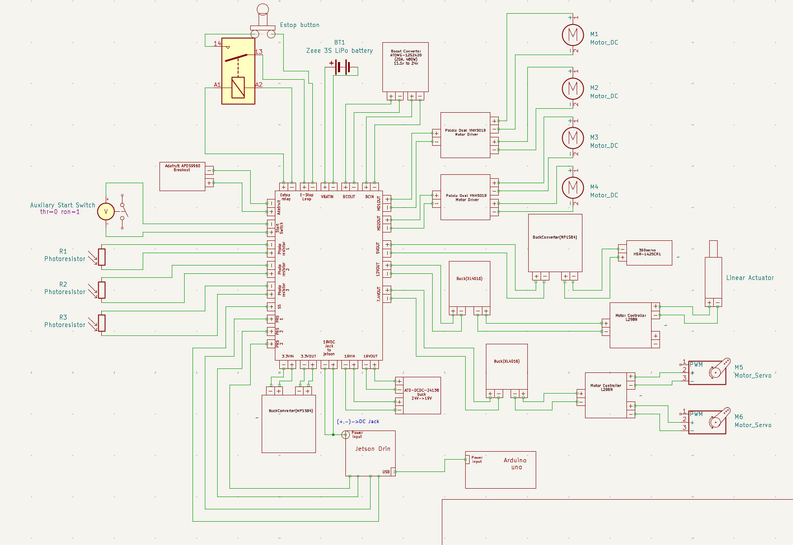
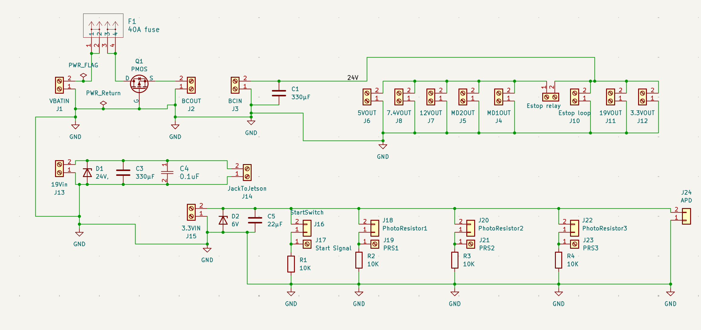
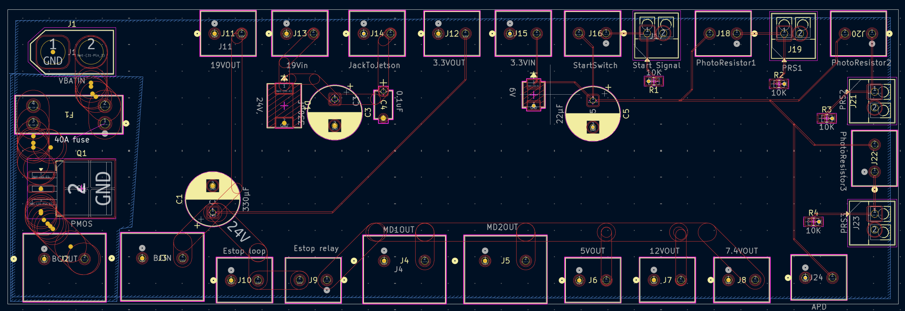
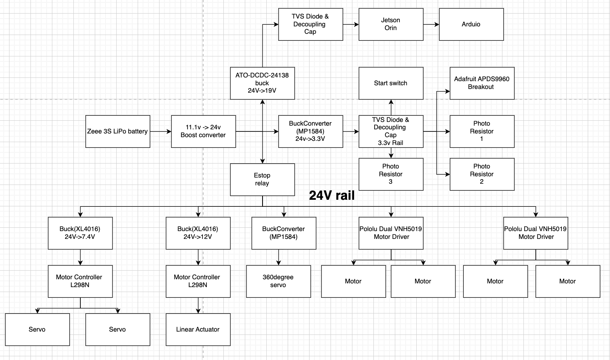
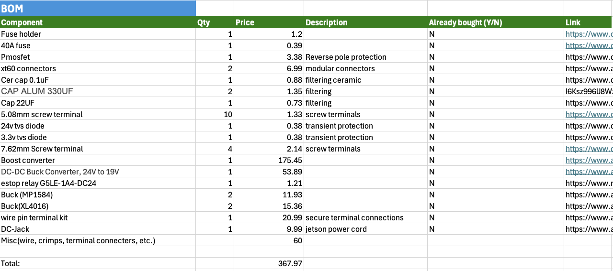

# Power Subsystem

The Power Subsystem is responsible for storing, converting, distributing, and protecting electrical energy for the entire robot. It supplies:

- 	The 24 V drivetrain motors (Pololu 150:1 37D 24 V metal gearmotors with encoders).
-	The motor drivers (Pololu Dual VNH5019 motor driver shield).
-	The Jetson Orin Nano global controller, and Arduino nano as the supporting microcontroller.
-	All sensors, servos, and auxiliary electronics listed in the PowerSheet.

## The subsystem:

1.	Accepts energy from a removable 3S LiPo pack (Zeee 11.1 V 5200 mAh, 80 C, XT60 connector). 
2.	Uses a boost converter to generate a regulated 24 V bus (VBUS_HI) for the motors and downstream converters.
3.	Uses buck converters from the 24 V bus to generate lower-voltage rails (3.3V, 5V, 7.4V, 12V, 19V). Contacts made through screw terminals, allowing for test points on each rail.
4.	Implements a hard emergency stop (E-Stop) and fusing that can safely isolate the battery from all loads. 
5.	Monitors voltage and current and reports power-health information to the controller.

## Specifications and Constraints

### Electrical Specifications
- **Source: Zeee 3S LiPo battery**
  - Nominal voltage: 11.1 V (3S1P)
  - Voltage range: 9.0–12.6 V
  - Capacity: 5200 mAh (5.2 Ah)
  - Discharge rating: 80 C (max current >> system needs)
  - Connector: XT60 hard-case pack (amazon.com)

- **24 V bus (VBUS_HI):**
  - Nominal output: 24 V DC
  - Regulation: 24 V ± 5% under loads from 0 A to 8 A
  - Continuous power rating: ≥ 192 W
  - Peak power rating (e.g., motor stall / acceleration): ≥ 576 W

- **Drivetrain load:**
  - Motors: Pololu 150:1 37Dx73L mm 24 V with 64 CPR encoder and helical pinion
  - No-load at 24 V: ~0.1 A
  - Stall current at 24 V: 3 A per motor
  - Number of motors: 4
  - Total stall current @ 24 V: 3 A × 4 = **12 A**

- **19 V rail (Jetson Orin):**
  - Voltage: 19 V ± 5%
  - Continuous current: ≥ 5 A
  - Short-term peak: ≥ 7 A

- **12 V rail (L298N):**
  - Voltage: 12 V ± 5%
  - Continuous current: ≥ 3 A
  - Peak current: ≥ 6 A

- **7.4 V rail (L298N for 2 normal servos):**
  - Voltage: 7.4 V ± 5%
  - Continuous current: ≥ 5.1 A
  - Peak current: ≥ 10.2 A

- **5 V rail (5V – HSR-1425CR):**
  - Voltage: 5 V ± 5%
  - Continuous current: ≥ 0.7 A
  - Peak current: ≥ 1.4 A

- **3.3 V rail (STM32F405, nRF51822, BMI088, BMP388, APDS9960):**
  - Voltage: 3.3 V ± 5%
  - Continuous current: ≥ 0.133 A
  - Peak current: ≥ 0.266 A

- **Efficiency & runtime targets:**

- 	Runtime goal: ≥ 3 minutes at average power 60W.

## Safety, Standards, and Ethical Constraints

- **Over-current protection:**
  - Input fuse sized to ~1.25–1.5× nominal battery current to protect wiring and downstream circuitry.

- **Emergency Stop:**
  - E-Stop must remove power from all motors, actuators, and servos by interrupting the high-current path from the battery positive after the main fuse.

- **LiPo-specific safety:**
  - Pack must not be over-charged or over-discharged and must be charged with a proper balance charger.
  - Battery must be mechanically protected to reduce risk of puncture or short.
  - Pack must be removed from robot during charging. Robot is prohibited from functioning during charging.

- **Standards:**
  - The design follows the intent of:
    - **ISO 13849-1** — safety of machinery (safety-related parts of control systems)
    - **IEC 60950-1** — IT equipment safety  
    (in terms of fusing, emergency stop, and creepage/clearance)

- **Socio-economic:**
  - Power subsystem BOM must remain within a budget of **$400 USD** to keep the project feasible for a student team.

---

## Physical and Integration Constraints

- Maximum envelope for the power subsystem: **4 × 8 × 7 in** within the chassis.
- Must accommodate at least one **Zeee 3S 5200 mAh pack**.
- Use **XT60** for battery connection and appropriately rated **Phoenix Contact** connectors for the 24 V bus and major rails.
- Wire gauge, PCB traces, and connector ratings must meet or exceed calculated continuous and peak currents with ~20% margin.

---

## Overview of Proposed Solution

The chosen architecture:

Zeee 3S LiPo (11.1 V) → Main Fuse → E-Stop → 24 V Boost Converter (VBUS_HI)

- 24 V → Pololu Dual VNH5019 motor driver shield → 24 V gearmotors  
- 24 V → 19 V buck converter → Jetson Nano → Arduino  
- 24 V → 5 V and 7.4 V buck regulator → servo rails  
- 24 V → 12 V buck regulator → linear actuator
- 24 V → 3.3V buck regulator -> sensors

---

## Key Design Decisions

### **1. 3S LiPo + Boost vs. Native 24 V Battery**
- **Chosen:** 3S LiPo + boost.
- **Rationale:**
  - 3S LiPo packs are inexpensive, widely available, and compatible with common RC chargers.
  - Boosting to 24 V provides a stable motor bus and simplifies downstream buck converter design.
  - Avoids weight and cost of carrying a large 24 V battery pack during prototyping.

---

### **2. 24 V Motors + VNH5019 Driver**
- **Motors:** Pololu 24 V 37D 150:1 gearmotors with encoder (3 A stall each).  
- **Driver:** Pololu Dual VNH5019 motor driver shield (5.5–24 V, up to 12 A continuous).  
- **Rationale:**
  - VNH5019 has substantial current headroom and built-in over-current + thermal protection.
  - Integrated current sense enables stall detection and load monitoring.

---

### **3. Boost Converter to 24 V**
- Regulates the variable battery input (9–12.6 V) to a constant **24 V bus**.
- Sizing based on:
  - Motor power (near-stall or heavy load)
  - 19 V Jetson rail
  - Servo and auxiliary loads
- **Design target:** ≥ 400 W continuous, ≥ 600 W peak.

---

### **4. Buck Stages for Low-Voltage Rails**
- 24 V → 19 V buck for Jetson (also powers Arduino via USB).
- 24 V → 12 V, 7.4 V, and 5 V bucks isolated to prevent servo noise from causing controller brownouts.

---

### **5. Safety & EMC**
- **40 A main fuse**, E-Stop, and optional contactor provide full hardware isolation.
- TVS diodes, ceramic capacitors, and EMI filters suppress switching noise.
- PCB layout separates high-current switching loops from sensitive digital/analog circuits.

---

## Interface with Other Subsystems

### Power Interfaces

- **Battery Interface:**
  - Connector: XT60  
  - Signals:
    - `BAT+` (9–12.6 V)
    - `BAT−` (GND)

- **Drivetrain Interface:**
  - 24 V bus (VBUS_HI) → Pololu Dual VNH5019 motor driver  
  - Driver outputs → Motor terminals (M1A/M1B, M2A/M2B)

- **Jetson Interface:**
  - 19 V rail and GND

- **Arduino Interface:**
  - USB power/data from Jetson

- **Actuation / Servo Interface:**
  - 12 V, 7.4 V, and 5 V rails + GND

---

### Control and Telemetry Interfaces

- **E-Stop Loop:**
  - Wired through hardware E-Stop button.
  - Opening the loop:
    - Interrupts high-current battery path.
    - Disables boost converter (via EN pin).
    - Optionally triggers dump/bleeder path.

- **Power-Good (PG) Signals:**
  - `PG24` — 24 V bus regulation good  
  - `PG5` — 5 V rail good  
  - `PGservo` — servo rail good  
  - Used for start-up sequencing and safe shutdown.

- **Telemetry Bus (I²C):**
  - Exposes:
    - Battery voltage (via divider/ADC or monitor IC)
    - 24 V bus current (shunt or Hall sensor)
    - Optional temperature sensors on boost converter & motor driver heatsinks

## Buildable Schematic

## Printed Circuit Board Layout
- PCB Schematic:

- PCB Layout:

- Pcb layout is still in progress due to learning curve and last minute revisions.
- Still Need:
  - Ground terminal to robot frame.
  - Appropriately placed heat dissipating vias.
  - Optimal traces and planes for the high currnt draw.
## Flowchart (Power-Up and E-Stop Behavior)

## Analysis of Crucial Design Decisions

---

### 1) Can the Zeee 3S LiPo power the whole system?

- **Energy:**  
  11.1V * 5.2Ah ~ 57.7Wh

- **Runtime estimate:**  
  Estimated average power: **365 W**  
  Overall efficiency: **~80%**  
  Is ~ (57.7 Wh × 0.8) / 365 W = 0.1265 hours. Runtime is ≈ 7.6 minutes.
- **Conclusion:**  
  The 80C rating provides ample current headroom.  
  The limitation is keeping runtime under 3 minutes, not current capability.

---

### 2) Current headroom for drivetrain

- **Motors:**  
  Each motor stall: **3 A @ 24 V**  
  Four motors → **12 A total stall**.  

- **Driver (Dual VNH5019):**  
  - 12 A continuous per channel (30 A peak)  
  - 24 A continuous when channels are paralleled  

- **Conclusion:**  
  The motor driver has sufficient margin for expected stall loads, assuming proper thermal design.

---

### 3) Boost converter stresses

- **Output power:**  
  - At 24 V and 16 A, output power is 384 W.
  
- **Battery current needed:**  
  Assuming 90% converter efficiency:
   - Battery current ≈ 384 / (0.9 × 11.1) ≈ 38.4 A.
  
- **Implications for component selection:**  
  - Battery connectors (XT60 rated ~60 A)  
  - Fuse (slightly above max continuous current)  
  - E-Stop and contactor ratings  

---

### 4) Safety and standards alignment

- Fuse and E-Stop placement follow recommended practice and align with **ISO 13849-1**:  
  - E-Stop removes power to **all motion-producing elements** via one clear path.

- Use of TVS diodes, filtering, and grounding techniques reduces EMI risks affecting sensors and controllers.

---

### 5) Grounding strategy and signal integrity

- A routed ground path could have been used, but it introduces:
  - Higher impedance  
  - Discontinuities  
  - Noise susceptibility (especially with motor drivers near sensitive electronics)

- The design instead uses:
  - A **full-layer ground plane** for low impedance return paths and minimized loop area  
  - Improved EMI performance and signal clarity

- The aluminum chassis will be tied to an **absolute chassis ground**, improving:
  - ESD protection  
  - EMC behavior  
  - Overall system grounding stability  

---

### 6) Ethical considerations

- Proper LiPo handling reduces fire and injury risks:
  - Correct balancing chargers  
  - Mechanical protection  
  - Avoiding over-discharge  

- Clear labeling of battery, fuse, and E-Stop improves long-term safety for future operators or maintainers.

---

### 7) Feasibility and cost

- Using a 3S LiPo + boost + buck architecture:
  - Minimizes part count  
  - Uses COTS modules like the VNH5019  
  - Simplifies prototyping and repairs  

- Total cost remains within the **$400 power subsystem budget** while meeting all performance and safety requirements.

## Bill Of Materials

## References

Batteries & Connectors

[1] Zeee Power, “Zeee 3S 11.1 V 5200 mAh 80C LiPo Battery,” Amazon Product Page, 2024.
https://www.amazon.com/dp/B07PPDLFVD

[2] Amass Electronics, “XT60/XT90 Connector Specifications,” 2023.
https://www.amass.com.cn/products/xt_series/

Motors & Motor Drivers

[3] Pololu, “150:1 Metal Gearmotor 37Dx73L mm, 24 V with 64 CPR Encoder,” 2023.
https://www.pololu.com/product/4729

[4] Pololu, “Dual VNH5019 Motor Driver Shield for Arduino,” 2023.
https://www.pololu.com/product/2507

[5] STMicroelectronics, “VNH5019A-E Full-Bridge Motor Driver Datasheet,” 2022.
https://www.st.com/resource/en/datasheet/vnh5019a-e.pdf

Microcontrollers & Computing Platforms

[6] STMicroelectronics, “STM32F405xx ARM® Cortex®-M4 MCU Datasheet,” 2023.
https://www.st.com/resource/en/datasheet/stm32f405rg.pdf

[7] Nordic Semiconductor, “nRF51822 Multiprotocol Bluetooth® SoC,” 2021.
https://infocenter.nordicsemi.com/pdf/nRF51822_PS_v3.1.pdf

[8] Arduino, “Arduino Mega 2560 Rev3 Technical Specs,” 2023.
https://docs.arduino.cc/hardware/mega-2560

[9] NVIDIA, “Jetson Orin Nano Series Module Datasheet,” 2023.
https://developer.nvidia.com/embedded/jetson-orin-nano

Sensors

[10] Bosch Sensortec, “BMI088 Inertial Measurement Unit Datasheet,” 2022.
https://www.bosch-sensortec.com/media/boschsensortec/downloads/datasheets/bst-bmi088-ds000.pdf

[11] Bosch Sensortec, “BMP388 Barometric Pressure Sensor Datasheet,” 2022.
https://www.bosch-sensortec.com/media/boschsensortec/downloads/datasheets/bst-bmp388-ds001.pdf

[12] Broadcom, “APDS-9960 Gesture/Ambient Light/Proximity Sensor Datasheet,” 2021.
https://docs.broadcom.com/doc/AV02-2315EN

Boost & Buck Converters

[13] Texas Instruments, “DC/DC Boost Converter Design Guide,” 2022.
https://www.ti.com/lit/an/slva061/slva061.pdf

[14] Texas Instruments, “DC/DC Buck Converter Design Guide,” 2022.
https://www.ti.com/lit/an/slva477b/slva477b.pdf

[15] Murata Power Solutions, “Low-ESR Ceramic Capacitors for Switching Supplies,” 2021.
https://www.murata.com/en-us/products/capacitor/low-esr-guide

Fuse & Protection Components

[16] Littelfuse, “ATO/ATC Blade Fuse Series Datasheet,” 2022.
https://www.littelfuse.com/products/fuses/automotive-fuses/blade-fuses/ato.aspx

[17] Littelfuse, “Automotive Fuse Holder Series,” 2023.
https://www.littelfuse.com/products/fuse-blocks-holders-clips/automotive.aspx

[18] ON Semiconductor, “Reverse Polarity Protection Using P-Channel MOSFETs,” Application Note AND8094/D, 2020.
https://www.onsemi.com/pub/Collateral/AND8094-D.PDF

PCB Design Principles

[19] Texas Instruments, “AN-2020: PCB Layout Guidelines for Power Electronics,” 2022.
https://www.ti.com/lit/an/snva489c/snva489c.pdf

[20] Analog Devices, “MT-101: Decoupling Techniques,” 2021.
https://www.analog.com/media/en/training-seminars/tutorials/MT-101.pdf

[21] IPC, IPC-2221: Generic Standard on Printed Board Design, 2019.
https://www.ipc.org/ipc-2221

[22] H. Johnson and M. Graham, High-Speed Digital Design: A Handbook of Black Magic, Prentice Hall, 1993.
ISBN Search: https://isbnsearch.org/isbn/9780133957242

Grounding & Electrical Safety

[23] IEEE Standards Association, IEEE Std 1100–2022 (Emerald Book), 2022.
https://standards.ieee.org/standard/1100-2022.html

[24] UL, UL 60950-1: Information Technology Equipment Safety Requirements, 2019.
https://standardscatalog.ul.com/ProductDetail.aspx?productId=UL60950-1

General Power Systems & Filtering

[25] M. H. Rashid, Power Electronics: Devices, Circuits, and Applications, 5th ed., Pearson, 2020.
ISBN: https://isbnsearch.org/isbn/9780133125900

[26] R. Erickson and D. Maksimović, Fundamentals of Power Electronics, 3rd ed., Springer, 2020.
https://link.springer.com/book/10.1007/978-3-319-51107-1

[27] Analog Devices, “Application Note 44: Output Ripple Voltage Calculations for LC Filters,” 2021.
https://www.analog.com/media/en/technical-documentation/application-notes/an44fa.pdf
